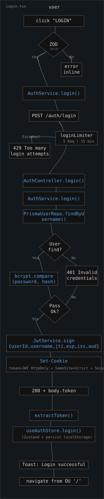
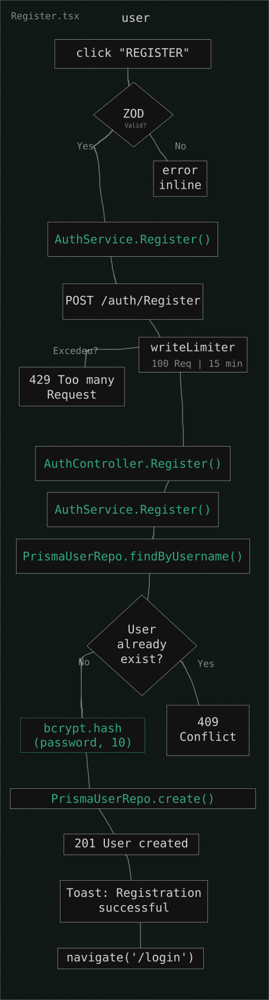
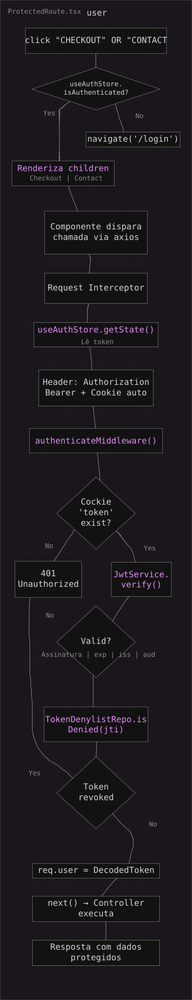
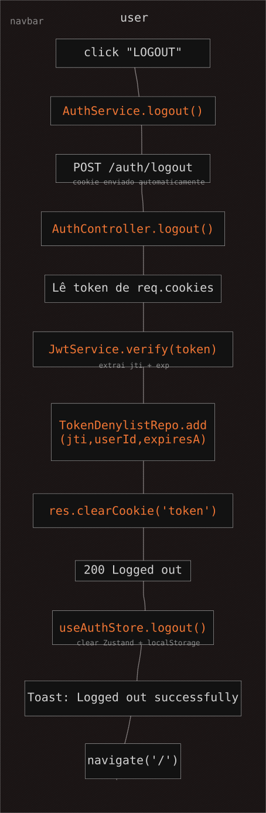
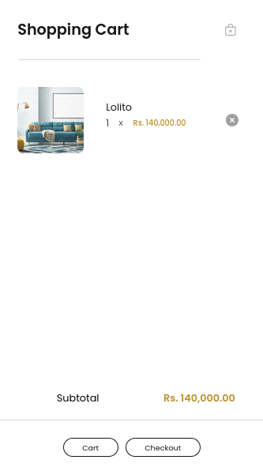
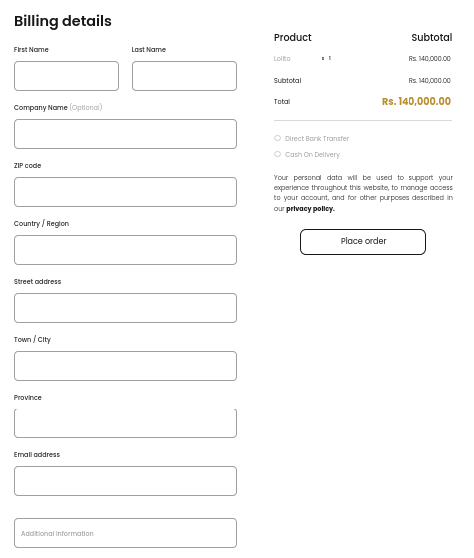
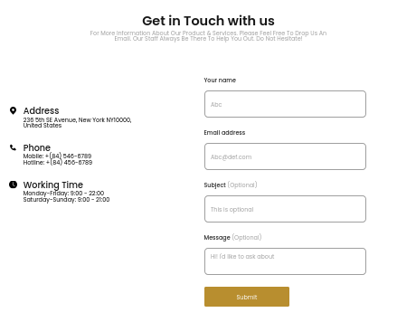

# Furniro

Final challenge of the Compass internship program. Requirements: authentication, checkout page, contact page, and cart sidebar.

## How to run

```bash
npm install
npm run setup
npm run dev
```

### Commands

| Comando            | O que faz                                                        |
| ------------------ | ---------------------------------------------------------------- |
| `npm run setup`    | Prepara o projeto do zero (env, dependências, migrations e seed) |
| `npm run dev`      | Sobe backend e frontend juntos                                   |
| `npm run doctor`   | Verifica se o ambiente está correto                              |
| `npm run check`    | Executa lint, typecheck, testes e build dos dois lados           |
| `npm run db:reset` | Remove o banco, reaplica as migrations e executa o seed          |
| `npm run db:seed`  | Popula o banco com produtos e usuários de teste                  |
| `npm run clean`    | Remove node_modules, dist e coverage                             |

---

# Too Long Don't Read

## Authentication

Based on my own repository, linked here: https://github.com/Jefferson-Tenorio/api-security-in-action-typescript

> JWT authentication system combining an HttpOnly cookie with a Bearer token, session state kept in Zustand and persisted to localStorage, and a JTI denylist for token revocation on logout. Protected routes use a wrapper component that redirects unauthenticated users to `/login`, preserving the original destination via `location.state`.

## Cart Side bar

> A side drawer controlled by its parent component (`isOpen`/`onClose`), reading items and subtotal directly from `useCartStore` (Zustand) through individual selectors. The item list is rendered with a memoized component (`SidebarCartItem`), item removal goes through the store's `removeItem`, and navigation to `/cart` or `/checkout` closes the drawer before redirecting.

## Checkout Page

> An 11-field address form plus payment method selection, backed by a single page-level `useForm` distributed to children via `FormProvider`/`useFormContext`. Address auto-fill from the ZIP code (CEP) fires on blur, querying the ViaCEP API. Validation runs through Zod; on submit, the cart is cleared and the user is redirected home after 2 seconds.

## Contact Page

> A 4-field form (name, email, subject, message) with its own `useForm` instance, independent of any page-level context. Validation runs through Zod (name and email required, subject and message optional); on submit it fires the `onSubmit` callback received as a prop and shows a confirmation toast.

# Authentication

<table>
  <tr>
    <td align="center">
      <a href="docs/Login.svg">
        
      </a>
      <br>
      <strong>Login</strong>
    </td>
    <td align="center">
      <a href="docs/Register.svg">
        
      </a>
      <br>
      <strong>Register</strong>
    </td>
    <td align="center">
      <a href="docs/Request.svg">
        
      </a>
      <br>
      <strong>Request</strong>
    </td>
    <td align="center">
      <a href="docs/Logout.svg">
        
      </a>
      <br>
      <strong>Logout</strong>
    </td>
  </tr>
</table>

Login generates a JWT signed with HS256, containing `userId`, `username`, a `jti` unique to each token (via `crypto.randomUUID()`), plus the standard expiration, issuer, and audience claims — all validated on verification, not just the signature. The token travels in an HttpOnly cookie with `SameSite=Strict` (mitigating CSRF), and in parallel a copy is mirrored into Zustand and persisted to localStorage, used only for UI reactivity and so the Axios interceptor can build the `Authorization: Bearer` header. In other words, every authenticated request carries the token twice — once automatically via the cookie, once explicitly via the header — which is redundant, but it guarantees the backend accepts both cookie-based and header-based clients without coupling the middleware to a single strategy. Login is rate-limited to 5 attempts per 15 minutes (registration: 100), and logout doesn't just clear local state: the token's `jti` goes into a denylist table along with its expiration, and the authentication middleware checks that table on every request — so a token stolen before logout becomes invalid immediately after, not only once it naturally expires. The open issue is purging that denylist: expired entries aren't removed automatically, so the table grows indefinitely with no cleanup routine.

# Cartsidebar



This is a drawer controlled from the outside — it receives `isOpen` and `onClose` from `RightMenu` and doesn't manage its own open state. Every piece of data comes from individual `useCartStore` selectors (`items`, `removeItem`, `getSubtotal`), which avoids prop drilling but couples the component to how the store is structured. The animation uses `translate-x` instead of manipulating `right`, which is lighter since it runs on the GPU instead of forcing a reflow. Two decisions are worth noting because they're deliberate trade-offs, not things discovered after the fact: the panel height is fixed in pixels (`746px`), which matches the design exactly but breaks on smaller screens; and the subtotal uses `getSubtotal()`, which ignores discounts — the store has a `getTotal()` that applies discounts, but it isn't used here, creating an inconsistency between the value shown in the sidebar and the actual order total. There's also no focus trap: `aria-modal="true"` is present, but keyboard focus normally escapes the drawer, and there's no Esc-to-close.

# Checkout



Eleven address fields live under a single page-level `useForm`, distributed to children via `FormProvider` — a decision that only pays off past a certain field count; for a small form, passing `control` directly would be simpler. The standout feature is CEP (Brazilian ZIP code) auto-fill: on field blur (not on every keystroke, avoiding rate limits on ViaCEP's public API), a request fetches the street, city, and state and populates the corresponding fields via `setValue`, clearing any validation errors already shown. This is deliberately tied to Brazil — there's no fallback for other countries. Payment method selection uses custom buttons controlled by `Controller` instead of native `<input type="radio">`, which gives full visual control but costs accessibility: there's no `role="radio"`, no `aria-checked`, and no arrow-key navigation — the most serious gap documented in the whole flow. The same discount-ignoring issue from the Cart Sidebar repeats here, and the entire submit step is a placeholder: the data goes to `console.log`, the cart is cleared, and the user is redirected after 2 seconds, with no real API call.

# Contact



Unlike Checkout, the decision here was not to share form context — `ContactForm` creates its own `useForm` instance, isolated from any parent component, because there's no second form on the same page to justify a shared provider. Even so, it uses the same `FormField` component as Checkout, keeping the visual identity identical between the two without duplicating styles. Validation only requires name and email; subject and message are optional, with no minimum character length and no spam protection at all (no honeypot, no rate limit) — the form accepts repeated programmatic submissions with zero friction. Just like Checkout, there's no real API call: submitting fires a success toast and nothing else, and there's no loading state or button-disable during submission, which leaves room for a double submit on slow connections.

# Stack

#### Frontend

[](#) [](#) [](#) [](#) [](#) [](#) [](#) [](#) [](#) [](#) [](#) [](#) [](#)

#### Backend

[](#) [](#) [](#) [](#) [](#) [](#) [](#) [](#) [](#) [](#)
